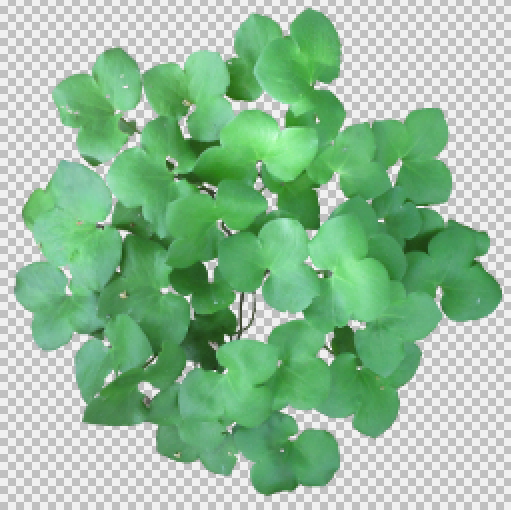
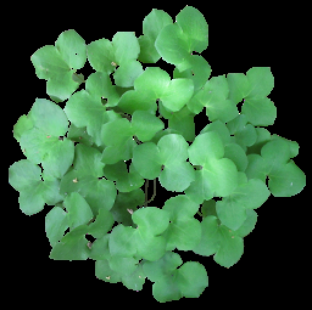
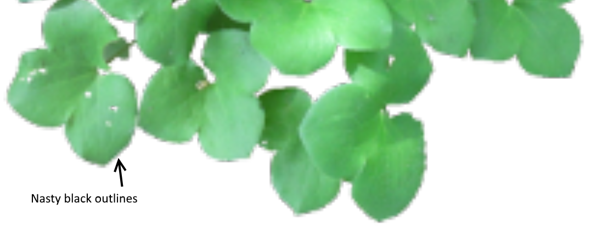

# Pre-Multiplied Alpha
Pre-Multiplied alpha blend is a blend mode has been around for a long time, but it seems to be re-discovered every few years.

Typically, the primary reason to  use pre-multiplied alpaha is to get rid of back outlines when rendering.

For example, if you are rendering some leaves, you have an alpha channel indicating the leaf edges.

|  |   | 
|:--:| :--:|
| *A typical alpha blended texture* | *The color channels in the texture* |

Rendering with the standard blend mode (alpha, 1-alpha) results in color bleeding in around the leaf edges. (ie. black)

 

Most games resolve this by having artists fill in these background areas with a fill color (ie green).
*However* by pre-multiplying the image offline and using pre-multiplied alpha blend mode (1, 1-alpha) this "in fill" is not necessary.


 


```
Tip: The DXT1A texture compression format was designed for use with pre-multiplied alpha.
```

## The three in one blend mode

There are three main blend modes used in games:
- Additive - Used in sparks, fire, lights, glowing objects etc.
- Alpha Blend - Used in leaves, fences, smoke etc.
- Multiply - Used in stained glass windows, darkening smoke effects

|  | 
|:--:| 
| *Blend  modes from Morgan McGuire presentation* |

All three blending modes can be used as the pre-multiply blend mode by pre-processing the textures.
- Additive - Set alpha to zero.
- Alpha Blend - Multiply the color by the alpha value.
- Multiply - Store (1 - color) in the alpha channel, then set color to black. 

```
Tip: The multiply blend mode only supports a grey scale value when using pre-multiplied alpha.
By exporting two colors and doing multiply+add as the blend mode would support the full multiply blend mode.
You need "Dual Source Blending" support for this (eg. GL_ARB_blend_func_extended)
```

## Reducing overdraw with Pre-Multiplied Alpha

Another neat trick with pre-multiplied alpha is that if you have overlapping textures that are in known positions, you can pre-process them all down to one texture.

For example, if you have a smoke particle effect, you could add sparks to the smoke textures and render them for free.

Another example is if you have a head up display UI in the game made up of different blended elements. 


```
Tip: There is no limit to the number of textures you can combine, 
but you may start getting artifacts unless the textures and destination buffer is HDR.
```

## Reducing draw calls with Pre-Multiplied Alpha


## Links

There are may other resons to use pre-multipled alpha. Some of which are listed below:

http://www.realtimerendering.com/blog/gpus-prefer-premultiplication/

http://webglfundamentals.org/webgl/lessons/webgl-and-alpha.html

http://tomforsyth1000.github.io/blog.wiki.html#[[Premultiplied%20alpha%20part%202]]

https://developer.nvidia.com/content/alpha-blending-pre-or-not-pre

http://www.adriancourreges.com/blog/2017/05/09/beware-of-transparent-pixels/


## Tools
This project includes descriptions/examples and tools for using pre-multiplied alpha.
